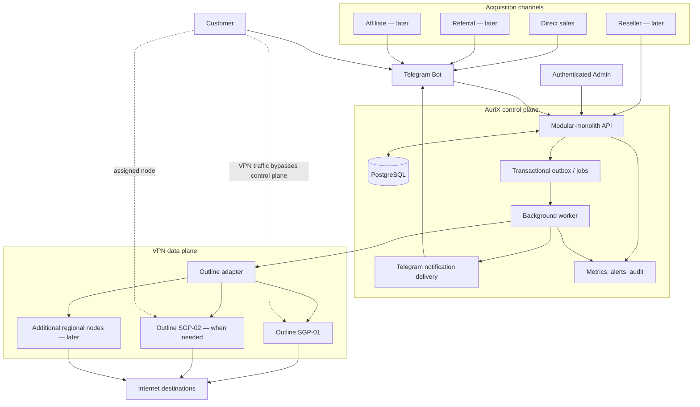
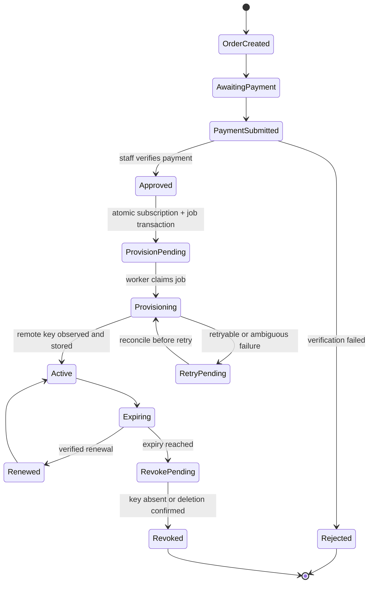
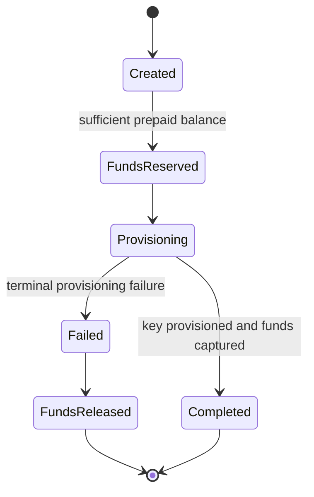

# AuriX Final Architecture

Status: canonical target architecture  
Scope: Telegram-first Outline VPN commerce platform  
Source study: [`deep-study-aurix-outline-conversation.md`](deep-study-aurix-outline-conversation.md)

## Final decision

AuriX will be a modular-monolith control plane around a separate Outline VPN data plane.

```text
Telegram = customer interface
AuriX backend = commercial source of truth and orchestration
PostgreSQL = durable state
Worker/outbox = reliable external effects
Outline = access-key and VPN execution
VPS pool = bandwidth, public IP, and regional exit
```

The control plane must never carry customer VPN traffic. Once a key is provisioned, an API or Telegram outage must not interrupt existing VPN sessions.

## System context



## Fixed architecture choices

| Concern | Decision |
|---|---|
| Application style | Modular monolith, not microservices |
| Primary interface | Telegram bot |
| Production bot transport | Authenticated Telegram webhook |
| Local/staging transport | Long polling is acceptable |
| Commercial database | PostgreSQL |
| External side effects | PostgreSQL-backed jobs and transactional outbox |
| VPN integration | Version-pinned Outline adapter with certificate pinning |
| VPN hosting | Public Linux VPS, initially Singapore |
| Management access | Private/allowlisted path; never exposed to customers |
| Customer identity | Telegram user ID; not a physical-device identity |
| Product entitlement | Time plus bandwidth; no dependency on device fingerprinting |
| Payment | Staff-assisted verification in the first paid pilot |
| Scaling | Add Outline nodes from measured bandwidth and health data |
| Distribution | Direct → referral → affiliate → reseller, gated by evidence |
| Reseller money | Prepaid wallet with immutable ledger and reserve/capture/release |

## Control-plane modules

The modules live in one deployable application and share one PostgreSQL database. Module boundaries are explicit in code, but there is no network boundary between them.

### Core paid-pilot modules

1. **Customers**
   - Telegram identity and status.
   - Minimal retained personal data.
   - Support and abuse state.

2. **Catalog**
   - Plans, duration, quota, price, currency, and activation state.
   - No hard-coded commercial values in bot handlers.

3. **Orders**
   - Immutable purchase snapshot of price, currency, and selected plan.
   - Explicit state machine and idempotent approval.

4. **Payments**
   - Staff submission/verification first.
   - Unique provider reference.
   - Verified, rejected, refunded, and reversal states.

5. **Subscriptions**
   - Start, expiry, entitlement, renewal, and lifecycle state.
   - UTC timestamps.

6. **VPN provisioning**
   - Server selection.
   - Outline key create, quota application, reconciliation, and revoke.
   - One active key at most per subscription.

7. **Notifications**
   - Key delivery, payment decision, usage warning, expiry, and renewal.
   - Delivery retries never create another key.

8. **Admin and audit**
   - Individual admin identity.
   - Payment decisions, wallet changes, key operations, and overrides audited.

9. **Server operations**
   - Health, transfer, capacity status, failed jobs, and alerts.

### Later modules

These remain in the same modular monolith and are enabled only after their entry gates pass:

```text
referrals and reward ledger
affiliate attribution and payout ledger
reseller accounts, customers, wallet, and orders
multi-node allocation and regional catalog
unit-economics analytics
```

## Source-of-truth rules

| Fact | Authoritative owner |
|---|---|
| Customer identity and status | AuriX PostgreSQL |
| Price charged and currency | Order snapshot |
| Payment result | Verified payment record |
| Subscription validity | AuriX subscription record |
| Commercial entitlement | AuriX plan/subscription record |
| Outline key existence and traffic | Outline, reconciled into AuriX |
| Key-to-customer mapping | AuriX VPN key record |
| Server allocation | AuriX server registry |
| Telegram delivery status | Notification record |
| Referral/affiliate attribution | AuriX attribution records |
| Reseller balance | Sum/reconciliation of wallet ledger entries |

Outline does not decide whether a Telegram customer paid, qualifies for a referral, or owns an active subscription. AuriX does not claim a remote key exists until it is observed or reconciled with Outline.

## Core database

### Paid-pilot tables

```text
users
plans
orders
payments
subscriptions
vpn_servers
vpn_keys
jobs
outbox_events
notifications
audit_events
usage_snapshots
```

### Required constraints

```text
users.telegram_user_id                       UNIQUE
plans.code                                   UNIQUE
payments(provider, provider_reference)       UNIQUE
subscriptions.order_id                       UNIQUE
vpn_keys.subscription_id                     UNIQUE for the paid-pilot model
jobs(subscription_id, operation)             UNIQUE
outbox_events.dedupe_key                      UNIQUE
```

Additional invariants:

- money uses integer minor units and explicit currency;
- expiry is later than start;
- state values are constrained;
- access URLs are encrypted if re-delivery requires storage;
- access URLs, Telegram tokens, payment evidence, and management URLs are redacted from logs;
- every privileged or irreversible business action has an audit event.

### Distribution tables added later

```text
referrals
referral_rewards
affiliates
affiliate_attributions
affiliate_commissions
affiliate_payouts
resellers
reseller_customers
wallets
wallet_transactions
reseller_orders
```

## Purchase and provisioning lifecycle



### Approval transaction

One PostgreSQL transaction must:

1. lock the order;
2. no-op if already approved;
3. mark the payment/order approved;
4. create exactly one subscription;
5. create exactly one provisioning job/outbox event;
6. append an audit event;
7. commit before any Outline request begins.

### Provision worker

The worker must:

1. claim one pending job with a database lock;
2. check whether the subscription already has a remote/local key;
3. choose an eligible server;
4. create the Outline key and apply the entitlement;
5. reconcile an ambiguous timeout before creating another key;
6. persist the key mapping and activate the subscription;
7. create a notification job;
8. retry with bounded backoff or move to operator review.

### Telegram delivery

Telegram delivery is a separate idempotent operation:

```text
key provisioned
  → notification pending
  → send
  → delivered
```

If sending fails, retry the same notification. Never provision a replacement key merely because Telegram delivery failed.

### Expiry and revocation

```text
active subscription reaches expires_at
  → mark expired/revoke pending
  → enqueue revoke job
  → delete or confirm key absent
  → record revoked_at
  → notify customer
```

Repeated revoke attempts must be safe. An existing VPN key may continue working while the control plane is down, so expiry revocation needs a measured service-level objective and alerts.

## Outline adapter contract

The adapter is the only module allowed to know management URLs and server certificates.

Required operations:

```text
list keys
get key
create key
set/remove per-key data limit
rename key
read transfer metrics
delete key
get server health/info
```

Requirements:

- pin the management certificate fingerprint and fail closed on mismatch;
- URL-encode key IDs;
- use strict request timeouts;
- distinguish retryable transport failure from authoritative HTTP rejection;
- redact secrets and access URLs;
- capture redacted fixtures from the installed Outline version;
- reconcile uncertain create/delete outcomes;
- never expose the management API or its secret path to Telegram, customers, affiliates, or resellers.

## Server registry and allocation

Each server record contains at least:

```text
id
provider
region
status
management-secret reference
transfer allowance
provider-account transfer used
Outline transfer observed
health timestamp
allocation threshold
customer count
```

Initial allocation policy:

```text
eligible = healthy
        AND accepts_new_keys
        AND region matches product
        AND transfer headroom remains

choose eligible server with greatest verified headroom
```

Suggested capacity states are configuration, not hard-coded truth:

```text
NORMAL
WATCH
STOP_NEW_ALLOCATION
CRITICAL
```

The number of users is never the sole capacity signal. Measure aggregate transfer, peak Mbps, packet loss, CPU, memory, connection failures, and provider-account limits.

## Product model

The commercial unit is a time-bounded bandwidth entitlement attached to one or more keys—not a hardware device fingerprint.

Candidate launch plans from the study:

| Plan | Price | Entitlement | Launch status |
|---|---:|---|---|
| Trial | Free | small test allowance | validate first |
| Basic | 3,000 MMK | 50 GB | candidate |
| Standard | 6,000 MMK | 100 GB | candidate |
| Premium | 7,000 MMK | fair-use/high-use | hold until usage evidence |
| Family | 12,000 MMK | explicitly defined pooled/multi-key entitlement | hold until semantics and economics are defined |

Do not promise literal unlimited use. Do not describe a rolling Outline limit as a calendar-month reset unless AuriX implements and verifies that behavior itself.

## Distribution architecture

### Referral — first extension

```text
deep link
  → new customer
  → paid and non-refunded qualification
  → reward ledger entry
  → bounded GB/service credit
```

No reward for clicks or signups. Monthly caps and reversal rules are mandatory.

### Affiliate — after positive direct/referral economics

```text
tracking attribution
  → verified purchase
  → pending commission
  → qualification window
  → payable
  → paid or reversed
```

Use one attribution window and one starting commission tier. Affiliates receive approved marketing claims and no infrastructure access.

### Reseller — after affiliate/referral evidence



The reseller owns the commercial relationship; AuriX owns infrastructure, central customer records, policy, abuse controls, and audit. Start prepaid. Do not launch reseller credit, white-label, inventory, or multi-level commissions.

## Deployment topology

### Paid pilot

```text
Managed control-plane service
  ├── API/webhook process
  ├── one worker process
  └── secret manager/environment

Managed PostgreSQL
  ├── daily backups
  └── tested restore procedure

DigitalOcean Singapore VPS
  ├── Outline Server
  ├── public TCP/UDP access-key traffic
  └── management path restricted to the worker/control plane
```

If the hosting platform cannot provide a stable, allowlistable egress path, place a small authenticated relay or private tunnel near the Outline server. Do not solve this by exposing the management endpoint broadly.

### Scale topology

Add Outline nodes only after measured thresholds. New customers can be assigned to new nodes; automatic migration of existing customers is deferred until key replacement and customer communication are proven.

## Security and operations

Before paid launch:

- confirm local legal requirements and provider/payment terms;
- keep staging and production bots, databases, and Outline servers separate;
- validate Telegram webhook secret and allow POST only;
- use individual admin identities with MFA-capable authentication;
- rate-limit customer and admin mutations;
- encrypt sensitive retained values and redact logs;
- back up PostgreSQL and conduct a restore drill;
- alert on provisioning failures, revoke failures, server health, and capacity;
- define abuse, refund, leaked-key, management-credential, and server-outage runbooks;
- keep an append-only audit trail for payment, key, wallet, and policy actions.

## Availability boundaries

| Failure | Expected behavior |
|---|---|
| Telegram unavailable | Existing VPN works; notifications retry |
| Control-plane API unavailable | Existing VPN works; new purchases pause |
| PostgreSQL unavailable | No financial/provisioning mutation proceeds |
| Outline management API unavailable | Existing VPN usually works; jobs retry |
| One VPN node unavailable | Stop allocation, alert, assist affected customers |
| Payment provider unavailable | Orders remain pending; no provisioning |
| Worker crashes after remote create | Reconcile before another key is created |

## Delivery roadmap

### Gate 0 — external approval

Legal/provider/payment terms, privacy, refund, abuse, and support ownership are documented.

### Gate 1 — technical proof

One Singapore server, 10–20 known testers, real API fixtures, TLS pinning, client compatibility, transfer, latency, and stability measured.

### Gate 2 — paid concierge MVP

Direct sales only: Telegram, plans, staff-approved payment, subscriptions, idempotent provisioning, delivery, expiry, renewal, audit, and basic server monitoring.

### Gate 3 — economics

P50/P90/P95 usage, renewal, support time, failures, refunds, and contribution margin measured. Premium/fair-use plans remain gated.

### Gate 4 — referral

Qualified paid referrals, bounded rewards, ledger, and reversals.

### Gate 5 — affiliate beta

Ten to twenty affiliates with one attribution and commission policy.

### Gate 6 — reseller beta

Five to ten prepaid resellers with wallet ledger, customer creation, renewal, and support.

### Gate 7 — server pool

Multi-node allocation, capacity protection, and additional regions/providers only from measured demand.

## Current repository implementation and migration

The repository now contains a runnable paid-concierge staging slice in
[`app.py`](../app.py) and [`commerce.py`](../commerce.py): public tracked-user
300 MiB rolling-24-hour claims, rolling-30-day 3 GiB free entitlements, and
50 GiB/30-day and 100 GiB/30-day paid catalog items, receipt-photo evidence with optional untrusted vision extraction,
staff payment approval, an immutable wallet ledger, encrypted credential
delivery, SQLite jobs/notifications/audit state, an optional PostgreSQL
commercial-state backend, pinned Outline server/key/metrics calls,
deterministic-key recovery, quota-hit hard deletion, and expiry revocation.
The historical 100 MiB owner-only behavior remains available only through the
legacy constructor/test harness.

The supplied 1-vCPU/1-GB Droplet is intentionally documented for one process
with persistent SQLite unless a separate PostgreSQL service is provisioned.
This is a staging/resource decision, not a change to the production north star.
The live Outline version, Telegram credentials, firewall, and end-to-end network
behavior still require deployment evidence.

Remaining migration order:

1. Deploy and verify the public free/trial/paid staging slice against the actual Outline version.
2. Run a measured paid pilot and decide whether hosted PostgreSQL plus an independent worker is required before cohort expansion.
3. Move Telegram transport to an authenticated webhook when the control-plane host and operations justify it.
4. Add usage/economics measurement and operational alerts beyond the current admin capacity summary.
5. Enable referrals, affiliate, reseller, and multi-server modules only at their evidence gates.

The current tests prove local state-machine, failure-retry, encryption, adapter,
and fake-Outline behavior; they do not prove live Telegram, live Outline, real
payment, or production network behavior.

## Architectural north star

Every component and feature must help answer this question:

> Can AuriX acquire and retain a customer at positive contribution margin while reliably delivering an acceptable Myanmar VPN experience and correctly enforcing the customer’s entitlement?

If a feature does not improve that evidence, reliability, or economics, it waits.
