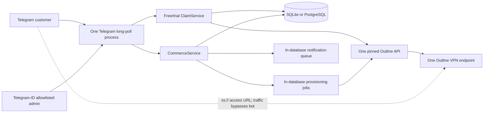
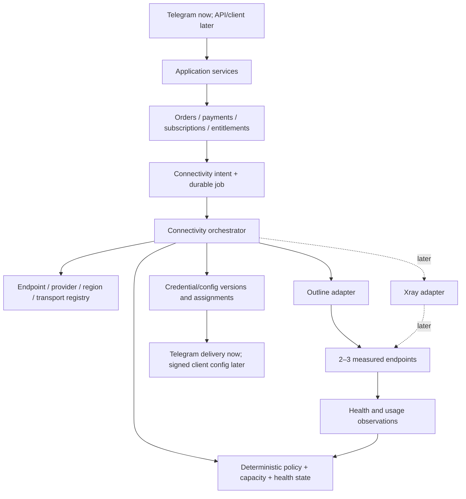

# AuriX codebase vs. VPN architecture conversations

Status: historical baseline with current-state addendum
Original date: 2026-08-29 (Asia/Rangoon)
Current evidence refresh: 2026-09-04 (Asia/Rangoon)
Scope: repository against the extracted Outline, V0–V13, resilience, and
market/final-architecture conversations. For live status, prefer
[`MVP_STATUS.md`](MVP_STATUS.md) and
[`AUTOSCALE_ARCHITECTURE_AND_RUNBOOK.md`](AUTOSCALE_ARCHITECTURE_AND_RUNBOOK.md).

## Executive verdict

The original study correctly identified a credible **single-Outline
paid-concierge MVP** with unusually good business-state handling for its size.
Since that study, the repository has added deterministic free/trial/promo
recovery, a three-node endpoint registry with capacity/admission policy, remote
orphan audits, fleet backups with verified archives, provider inventory, a
guarded infrastructure worker, and an identity-pinned activation gate.

It is not yet the adaptive V10–V13 connectivity platform described in the later conversations.

The most accurate current classification is:

```text
Business/control-plane maturity: hardened V2 foundation
Connectivity topology:          three declared Outline endpoints
Operational automation:         bounded fleet automation with guarded scale-out
Adaptive/network intelligence:  not implemented
```

The current code should therefore be treated as **Phase 2 of the later V13
plan**: a production-staged, multi-node Outline control plane, not a complete
adaptive V13 connectivity platform and not something that should be replaced
wholesale.

Current evidence is strong for code and controlled operations (329 tests, live
three-node health, CI-gated deployment, and verified encrypted archives), but
not yet for unrestricted customer admission: allocation normalization, orphan
classification, stable DNS, real Telegram/payment canaries, and sustained
observation remain explicit gates.

The correct next technical target is **V3: a small multi-node Outline control plane with explicit endpoint records and manual/controlled migration**. Xray, automatic failover, custom clients, multi-provider provisioning, and predictive routing should remain gated behind measured failures and real customer evidence.

## Sources and study boundary

Primary conversation sources:

- [`chatgpt_conversation_6a9246bf.md`](../chatgpt_conversation_6a9246bf.md) — V1–V13 exploration, threat modeling, observability, bounded automation, and V10–V13 comparison.
- [`chatgpt_conversation_6a924781.md`](../chatgpt_conversation_6a924781.md) — market judgment and the detailed six-plane final architecture.
- [`chatgpt_conversation_6a924803.md`](../chatgpt_conversation_6a924803.md) — Outline resilience, realistic version fact-checking, capacity, and Myanmar applicability.
- [`chatgpt_conversation_6a8f6e31.md`](../chatgpt_conversation_6a8f6e31.md) — original Outline-on-Render/business evolution that produced the existing repository architecture.

Repository evidence reviewed:

- application, commerce, receipt parsing, deployment wrappers, and environment configuration;
- SQLite and PostgreSQL schemas and state transitions;
- all four test modules;
- README, deployment docs, current MVP status, and canonical architecture;
- Render paid/free deployment profiles;
- Git state and dependency declarations.

This study compares the code to the conversations' architecture and product concepts. It does **not** independently re-verify the conversations' changing market, censorship, provider-price, or legal claims. Those require a separate current-source review before launch or investment decisions.

## What the conversations ultimately require

Across the three later conversations, the final direction converges on a few durable principles:

1. Identity, payment, subscription, and entitlement remain stable while credentials, endpoints, transports, regions, and providers are replaceable.
2. The control plane is the commercial source of truth and never carries customer VPN traffic.
3. A customer owns a logical connectivity profile, not a permanent VPS assignment.
4. Endpoint health is multidimensional and network-specific; one global `healthy = true` flag is insufficient.
5. Failover is a bounded state machine with circuit breakers, hysteresis, cooldowns, capacity checks, verification, rollback, and audit.
6. Outline, Xray, and future protocols sit behind adapters; adding a transport must not rewrite billing or subscriptions.
7. The data plane is replaceable and potentially hostile. Compromise of one VPN server must have a small blast radius.
8. A custom client is eventually required for seamless config updates, acknowledgements, connection verification, rollback, and privacy-preserving telemetry.
9. Advanced automation is earned by real measurements. Deterministic rules come before prediction or “AI routing.”
10. Economics and operations gate architecture growth: real usage distribution, support burden, failures, renewal, and contribution margin matter more than theoretical user counts.

The repository already embodies principles 1 and 2, plus bounded retry/audit mechanics that can later support principle 5. Principle 10 is documented, but the required economics are not yet measured.

## Current executable architecture



Key evidence:

- One `OUTLINE_API_URL` and one certificate pin are loaded at startup, then one `OutlineClient` is injected into both free and paid services ([app.py:2075](../app.py#L2075), [app.py:2116](../app.py#L2116)).
- The bot explicitly deletes any webhook and uses `getUpdates` long polling ([app.py:2029](../app.py#L2029), [app.py:2187](../app.py#L2187)).
- The paid Render profile deploys exactly one worker and a persistent SQLite disk ([render.yaml:1](../render.yaml#L1)).
- Customer VPN traffic does not pass through AuriX after delivery; this correctly preserves data-plane availability during bot/control-plane outages.

## Version classification

| Version concept | Conversation meaning | Repository status | Judgment |
|---|---|---|---|
| V0 | One private Outline server | Implemented | Exact current data-plane topology |
| V1 | Outline plus Telegram delivery | Implemented | Bot, free/trial claims, paid purchase, key delivery |
| V2 | Entitlement/key-management engine | Strong partial/mostly implemented | Plans, orders, payments, subscriptions, quotas, jobs, audit; no generic entitlement or credential model |
| V3 | Multi-region/multi-node Outline | Not implemented | No server/endpoint registry or assignment |
| V4 | Dynamic/adaptive Outline | Not implemented | No health state, endpoint scoring, reassignment, or migration workflow |
| V5–V8 | Xray/REALITY/multi-transport/multi-provider | Not implemented | Outline-specific code and schema throughout |
| V9 | Outline + Xray hybrid | Not implemented | No common transport adapter |
| V10 | Protocol-agnostic adaptive fabric | Architectural idea only | Existing business state is reusable; connectivity model is not |
| V11–V12 | Self-healing/autonomous network | Deliberately absent | Correctly deferred; no evidence base or client mechanism yet |
| V13 | Resilient connectivity operating system with bounded automation | Early foundation only | Job/retry/audit patterns are useful precursors, but the connectivity fabric is absent |

The code is therefore not “behind” in a simple feature-count sense. It correctly built much of the commercial foundation first. The mismatch is that some documents call the Outline-only target “final,” while the later conversations redefine the final target as protocol-agnostic V13.

## Capability matrix

| Capability | Evidence in current code | Maturity | V13 gap |
|---|---|---:|---|
| Telegram customer experience | Commands, buttons, orders, receipts, wallet, usage, renewals | Strong MVP | Presentation is coupled into a 98 KB module; no reusable HTTP API |
| Catalog/order snapshots | DB plans plus immutable price/quota/duration snapshots | Strong MVP | Startup forcibly resets two seeded products; no operator catalog workflow |
| Payment evidence and verification | Private Supabase object storage, metadata/hash, optional untrusted LLM extraction, human verification | Strong MVP | Retention lifecycle and automated provider verification remain separate gates |
| Wallet accounting | Immutable credit/reserve/capture/release/reversal ledger | Strong | Customer wallet only; no reseller entity or ledger reconciliation at scale |
| Subscription lifecycle | Pending/active/expired/revoked, independent simultaneous entitlements | Strong MVP | Subscription directly fulfills into an Outline-specific key rather than a generic entitlement/profile |
| Paid provisioning safety | Durable jobs, PostgreSQL `SKIP LOCKED`, deterministic key ID, ambiguous-create recovery | Strong | Job has no endpoint assignment, provider, region, or transport dimensions |
| Free/trial provisioning safety | Claim cooldown, local transaction, cleanup on local failure | Weak/medium | Remote create occurs inside the DB transaction and cannot reconcile an ambiguous timeout |
| Credential protection | Fernet-encrypted stored paid access URLs and encrypted notification payloads | Good MVP | No generic credential lifecycle, rotation/versioning, endpoint binding, or secret-store split |
| Outline management security | Exact certificate fingerprint pin, URL-encoded IDs, strict timeout | Good MVP | One static pin/management credential; no rotation workflow or per-endpoint trust inventory |
| Quota/expiry enforcement | Per-key limits, metrics observation, hard deletion, retries, escalation | Strong single-node | Usage is Outline/key-specific trailing-window data, not transport-normalized billing usage |
| Audit | Business and key lifecycle events | Good MVP | No append-only/tamper-evident guarantee, request correlation, policy/config version, or failover decision log |
| Notifications | Durable dedupe, retry, dead-letter state | Good single process | Delivery is selected without an atomic claim; unsafe for multiple notification workers |
| PostgreSQL | Optional pooled repository with transaction and job locking support | Partial production path | Not the default paid deployment; no migration framework or live DB evidence |
| Endpoint registry | None | Absent | Required before V3 |
| Provider/region abstraction | None | Absent | Required before provider or region diversity |
| Transport adapter | One concrete `OutlineClient` | Absent | Required before V9/V10 |
| Network-aware health | Management readiness, transfer metrics, process-only `/healthz` | Minimal | No probes by ISP/network/region, state transitions, confidence, hysteresis, or circuit breaker |
| Capacity allocation | Admin snapshot of one server and mapped key usage | Minimal | No endpoint headroom model or allocation policy |
| Failover/migration | Retry same Outline operation | Absent at network layer | No alternate endpoint, reissue, customer migration, verification, rollback, or failure budget |
| Custom client/config protocol | Raw Outline URL sent to third-party client | Absent | Seamless automatic adaptation is impossible without an edge agent |
| Observability | Optional latency lines, admin consistency/capacity views | Minimal | No durable metrics, dashboards, alerts, SLOs, tracing, network success signals, or business telemetry |
| Infrastructure lifecycle | Manual Outline/VPS runbooks; Render control-plane YAML | Minimal | No provider adapter, IaC for endpoint fleet, image/version inventory, drain/retire workflow |
| Disaster recovery | Persistent disk guidance and snapshot suggestions | Weak | No automated backup, restore test, RPO/RTO, secret recovery, or config reconstruction proof |
| Unit economics | Candidate prices and quota data | Absent operationally | No P50/P90/P95 usage, cost/GB, gross margin, churn, cohort, or support-cost pipeline |
| Referrals/affiliates/resellers | Explicitly deferred | Correctly absent | Add only after economics gates; customer wallet is not a reseller implementation |

## What the repository gets right

### 1. Control plane and data plane are genuinely separated

The bot provisions and delivers credentials, but customer VPN traffic goes directly to Outline. A Telegram or AuriX outage therefore does not inherently terminate an already-working tunnel. This is the most important foundation from both the original and final conversations.

The startup path now intentionally degrades when Outline is unavailable: the
bot remains available for recovery/admin functions, issuance is rejected by
the health gate, and maintenance continues probing. This closes the earlier
single-endpoint startup concern; a live multi-node canary and sustained outage
rehearsal are still operational evidence gates.

### 2. Money is separated from the remote provisioning effect

The paid flow records verified payment, order approval, subscription, wallet events, job, and audit state before the worker talks to Outline. This matches the conversations' authoritative-business-state principle. The approval transaction begins at [commerce.py:1908](../commerce.py#L1908), while remote provisioning begins later at [commerce.py:2448](../commerce.py#L2448).

### 3. Paid provisioning handles ambiguous external state unusually well

The worker uses a deterministic key ID, checks the remote inventory before creation, and rereads after ambiguous failure before considering a fallback ([commerce.py:2524](../commerce.py#L2524)). Local key persistence, subscription activation, notification creation, audit, and job completion are committed together ([commerce.py:2578](../commerce.py#L2578)).

That is a real implementation of the conversations' “intent → execution → observation → verification → committed state” discipline.

### 4. Retry automation is bounded and operator-visible

Jobs recover stale locks, use `FOR UPDATE SKIP LOCKED` on PostgreSQL, stop after bounded attempts, and can be requeued by an admin ([commerce.py:2301](../commerce.py#L2301)). Notifications dead-letter after bounded retries. Free-key deletion escalates after repeated failures. These are valuable V13 building blocks even though they do not yet perform connectivity failover.

### 5. Security choices are mostly appropriate for the MVP

- The Outline management certificate is pinned exactly before any HTTP request ([app.py:178](../app.py#L178)).
- Paid access URLs are encrypted at rest and only decrypted for authorized delivery ([commerce.py:798](../commerce.py#L798), [commerce.py:2972](../commerce.py#L2972)).
- Telegram numeric IDs, not usernames, authorize staff.
- Receipt LLM output is treated as untrusted and cannot approve a payment.
- Logs deliberately omit request payloads and credential material.

### 6. The test suite covers the current state machines well

All 89 unit tests pass in an isolated environment with the declared dependencies. Coverage includes concurrent claims, TLS pinning, ambiguous paid provisioning recovery, idempotent payments, receipt review, immutable wallet behavior, quota enforcement and threshold warnings, retries, dead letters, PostgreSQL query adaptation, Telegram warning delivery, and Render process health.

This proves local behavior against fakes. It does not prove real Outline-version compatibility, real PostgreSQL migrations, Telegram delivery, network quality, censorship resilience, multi-worker behavior, or live payment correctness.

## Critical gaps and risks

### P0 — external launch gates remain unproven

The repository itself states that live Telegram, Outline, firewall, payment, quota-hit, active-session termination, backup, and restore behavior remain unverified. No amount of additional V13 architecture compensates for skipping the first real 10–20-user proof.

Before a public paid launch, the minimum evidence is:

- live Outline API fixtures from the deployed version;
- a full payment-to-key-to-expiry/quota lifecycle;
- measured Myanmar client success by ISP/network/time;
- tested database backup and restore;
- legal/provider/payment-term review;
- incident and refund ownership.

### P1 — free/trial key creation bypasses the durable job pattern

`ClaimService.claim()`, `claim_trial()`, and giveaway claims still perform the
remote operation while holding a database write transaction. They now use a
stable deterministic Outline ID when the adapter supports caller-selected PUT,
and perform a read-after-ambiguous recovery before any POST fallback. This
closes the duplicate-after-timeout failure mode for current Outline versions,
  but does not yet remove the network call from the local transaction
  ([entitlements.py](../entitlements.py)).

Consequences:

- a network timeout can still hold the database write lock until the request
  path returns;
- legacy adapters without deterministic PUT support can still leave an
  ambiguous POST result that requires inventory reconciliation;
- the database write lock is held during a network call;
- free and paid credentials have different reliability guarantees.

Before multi-node work, free/trial and paid provisioning should converge on one intent/job/reconcile lifecycle and one credential table/model.

### P1 — the business core is still Outline-specific

The generic object in the final conversations is a credential attached to a connectivity profile and endpoint assignment. The current database instead has `paid_vpn_keys.outline_key_id`, and service logic calls `self.outline` directly.

That coupling means adding Xray currently requires changes across persistence, provisioning, quota logic, usage display, naming, admin views, and tests. A transport adapter interface alone is insufficient; the schema also needs generic credential/config records with transport-specific payload metadata behind them.

### P1 — no endpoint identity exists

There is no `vpn_servers`, `providers`, `regions`, `transports`, `endpoints`, or `endpoint_assignments` table, even though [`FINAL_ARCHITECTURE.md`](FINAL_ARCHITECTURE.md) already specifies a server registry. Every key implicitly belongs to the one process-global Outline endpoint.

Without endpoint identity, the system cannot answer:

- which customers are affected by a failed server;
- whether two servers share a provider/ASN/region failure domain;
- where a key should be provisioned;
- whether an endpoint is draining or accepting new allocations;
- how much headroom remains;
- which credential/config must be replaced during migration.

### P1 — “automatic failover” is impossible with the current client model

The customer receives an `ss://` URL and uses a third-party client. The control plane cannot atomically replace its endpoint, observe application of a new config, test success, or roll back.

Before a custom client exists, failover can only mean:

```text
detect outage
→ stop new allocations
→ generate replacement credential
→ notify customer
→ customer imports/reconnects manually
→ support verifies outcome
```

Calling that seamless or automatic would be inaccurate. A custom client is not required for V3 multi-node allocation, but it is required for the stronger V11–V13 adaptation promise.

### P1 — current health signals cannot drive routing

The `/healthz` endpoint only proves the child bot process is alive. `server_info()` proves the management API answered. `transfer_metrics()` gives per-key transfer counters. None proves that a customer on a particular Myanmar ISP can establish and use the data-plane transport.

The future health model needs separate signals for:

- management API reachability;
- endpoint process/resource health;
- TCP and UDP data-plane reachability;
- authenticated connection success;
- ISP/network-specific success and latency;
- capacity/headroom;
- freshness and confidence of evidence.

One failed probe must not trigger fleet-wide movement. State transitions require hysteresis, cooldown, minimum sample sizes, and an explicit failure budget.

### P1 — deployment and recovery do not match the stated production target

The canonical architecture says authenticated webhook, PostgreSQL, independent worker, backups, and tested restore. The paid Render profile uses long polling, one process, and SQLite. That is a valid controlled-pilot choice, but not production convergence.

There is also:

- no schema migration framework;
- no CI configuration;
- no dependency lock file;
- no automated backup/restore workflow;
- no infrastructure-as-code for VPN endpoints;
- no live integration or chaos test suite.

Most importantly, the entire application/docs/test set is currently untracked in Git. Only an earlier branding commit exists. Until the implementation is committed, reviewed, and recoverable, architectural sophistication is secondary.

### P2 — notification delivery is not ready for independent replicas

Provisioning jobs have an atomic database claim and PostgreSQL `SKIP LOCKED`. Notifications are read as pending and only marked sent afterward, without a running/lease state. Multiple notification workers can therefore send the same message concurrently. The current one-process topology hides this race.

Before splitting workers, notifications need the same lease/claim/idempotency discipline as provisioning jobs.

### P2 — usage is enforcement data, not yet a V13 telemetry system

The code reads Outline's rolling transfer counters and updates last-observed usage. It does not retain normalized raw/aggregate usage by endpoint, transport, billing period, ISP/network, or time bucket.

This is enough for current key limits. It is not enough for:

- fair-use accounting independent of Outline;
- endpoint scoring;
- P50/P90/P95/P99 usage economics;
- cost per active user or per GB;
- time-of-day capacity planning;
- comparing Outline with Xray;
- proving a Myanmar connectivity advantage.

### P2 — observability and audit are narrower than the conversations require

Optional latency lines and admin consistency output are useful diagnostics, but there are no durable metrics, SLOs, alerts, traces, correlation IDs, config versions, endpoint-state history, or decision records.

Metrics and audit must remain separate:

- metrics answer “how well is the system behaving?”;
- audit answers “who or what changed authoritative state, under which policy/config version, and why?”

### P2 — admin and privacy controls are pilot-grade

Telegram-ID allowlisting is appropriate for a tiny pilot, but there is no role model, MFA-capable admin surface, session/re-authentication policy, rate limiting, or dual control for sensitive actions. The database stores Telegram identity, receipt metadata/extractions, payment references, and audit history without a documented retention/deletion policy.

The code does minimize receipt storage by keeping hashes and Telegram file metadata instead of raw images. The tradeoff is that evidence availability depends on Telegram rather than operator-controlled object storage.

### P2 — plan/device/entitlement semantics remain implicit

The schema has plans and subscription snapshots, but no explicit entitlement, device, connectivity-profile, or policy object. This is acceptable for two quota plans. It cannot cleanly express:

- pooled family allowance;
- multiple credentials under one entitlement;
- transport eligibility;
- regional policy;
- max installations/devices;
- fair-use rules;
- migration without changing the commercial subscription.

The conversations correctly distinguish account, credential, installation, device, and session. The current model represents only account and Outline credential.

### P3 — lint and documentation drift

Ruff reports three unused local variables (`app.py`, `test_app.py`, and `test_mvp.py`). They are low-risk and mechanically fixable.

Documentation drift is more consequential:

- [`MVP_STATUS.md`](MVP_STATUS.md) says 57 tests; the suite now has 79.
- [`FINAL_ARCHITECTURE.md`](FINAL_ARCHITECTURE.md) calls an Outline-centric target canonical/final, while the later conversations redefine the north star as transport-agnostic V13.
- The architecture document describes a server registry that the code does not implement.
- The README accurately labels multi-node allocation as deferred, but the distinction between “current V2 MVP,” “next V3 target,” and “eventual V13” should be explicit everywhere.

## Recommended target architecture for this repository

The next design should preserve the existing commercial code while inserting a generic connectivity boundary.



The stable core objects should become:

```text
Customer
Subscription
Entitlement
ConnectivityProfile
EndpointAssignment
Credential
ConfigurationVersion
```

Infrastructure objects should become:

```text
Provider
Region
Transport
Endpoint
EndpointHealthObservation
EndpointStateTransition
CapacitySnapshot
```

The invariant is:

```text
customer/subscription survive
while assignment/credential/config/endpoint can change
```

## Prioritized implementation roadmap

### Gate A — prove and freeze the current pilot

Do this before structural V3 work:

1. Commit the current application, tests, docs, and deployment files in a reviewable baseline.
2. Add CI using the declared Python version and run all 79 tests plus Ruff.
3. Add a migration tool or explicit numbered migrations for SQLite/PostgreSQL.
4. Unify free/trial provisioning with the paid durable job/reconcile path.
5. Make control-plane startup degrade gracefully when Outline management is temporarily unavailable.
6. Add backup automation, a restore drill, and documented RPO/RTO.
7. Complete a live 10–20-user Outline/Telegram/payment/quota/expiry smoke pilot.
8. Record P50/P90/P95 usage, latency, connection success, support time, refunds, and cost per GB/user.

Exit condition: one endpoint is operationally boring, recoverable, measured, and profitable enough to justify another.

### Gate B — V3 multi-node Outline, manual migration

Add only the minimum generic connectivity model:

1. Introduce `providers`, `regions`, `transports`, `endpoints`, `connectivity_profiles`, `endpoint_assignments`, and generic `credentials` tables.
2. Register the current Outline server as the first endpoint; do not migrate behavior and schema simultaneously without compatibility code.
3. Replace process-global `self.outline` use with an endpoint-scoped `VpnAdapter` lookup.
4. Store endpoint ID on each credential and provisioning intent.
5. Add endpoint states: `PROVISIONING`, `ACTIVE`, `DEGRADED`, `DRAINING`, `FAILED`, `RETIRED`.
6. Implement deterministic allocation using only health freshness, capacity headroom, plan/region eligibility, and stable tie-breaking.
7. Add admin commands to register, inspect, stop allocation, drain, and manually reassign an endpoint.
8. Add two-endpoint fake and live tests, including one endpoint unavailable during create/revoke.

Exit condition: new users can be safely allocated across 2–3 Outline endpoints, and an operator can identify and manually migrate the affected cohort without corrupting entitlements or money.

### Gate C — controlled resilience

1. Persist endpoint observations and state transitions.
2. Separate management, data-plane, network-specific, and capacity health.
3. Add hysteresis, cooldown, circuit breaker, load shedding, and a per-window migration budget.
4. Add credential/config versioning and a verified manual replacement workflow.
5. Implement drain-before-retire and rollback.
6. Add outage simulation and failure-domain tests.

Without a custom client, keep customer migration explicit and assisted. Do not label it seamless automatic failover.

Exit condition: the system stops allocating to a bad endpoint from strong evidence, limits blast radius, and safely assists replacement without a migration storm.

### Gate D — V9 protocol diversity

Only after real Outline failure data shows a protocol-diversity need:

1. Define the transport adapter contract around generic credential/config operations, health, usage, revoke, and reconciliation.
2. Move Outline-specific names and payloads behind the Outline adapter.
3. Add Xray as the second adapter in a controlled region/provider test.
4. Normalize usage and health semantics without pretending different transports expose identical data.
5. Threat-model each adapter and assume endpoint compromise.

Exit condition: a subscription can be fulfilled by Outline or Xray without changing billing/order/subscription code, and both paths have live acceptance evidence.

### Gate E — V10/V11 client and adaptive selection

1. Build a narrowly scoped client/edge agent only after the control-plane model is stable.
2. Use authenticated, signed, versioned configurations.
3. Require apply acknowledgement, connection test, and rollback result.
4. Collect privacy-preserving network/transport success signals with consent and retention limits.
5. Start with deterministic endpoint scoring and confidence thresholds.
6. Add bounded automatic reassignment only after replay/simulation proves it reduces failures without overload or churn.

Exit condition: config changes are observable and reversible end to end. The server does not equate “command sent” with “client successfully connected.”

### Gate F — V13 optimization and business extensions

Advanced prediction, provider automation, referrals, affiliates, and resellers remain separate evidence-gated workstreams. None should block the connectivity core, and no distribution feature should gain infrastructure credentials.

## Concrete code-boundary changes

The smallest safe restructuring sequence is:

```text
current:
app.py
commerce.py
receipt_llm.py

first modular split:
aurix/
  application/       commands and use cases
  commerce/          plans, orders, payments, wallet, subscriptions
  connectivity/      profiles, assignments, credentials, orchestration
  transports/outline Outline management adapter
  workers/           job claims and effect execution
  telegram/          presentation and delivery
  persistence/       repositories and migrations
  observability/     metrics, audit, correlation
```

This should remain one deployable modular monolith. The split is for ownership and testability, not microservices.

Recommended first interfaces:

```python
class VpnAdapter:
    def provision(self, endpoint, credential_intent): ...
    def observe_credential(self, endpoint, external_id): ...
    def revoke(self, endpoint, external_id): ...
    def read_usage(self, endpoint): ...
    def probe_management(self, endpoint): ...

class EndpointRepository:
    def eligible(self, policy, now): ...
    def record_observation(self, observation): ...
    def transition(self, endpoint_id, expected_state, new_state, reason): ...

class AssignmentPolicy:
    def choose(self, profile, candidates, observations): ...
```

The policy should return a decision plus reasons and input-version IDs, so every allocation/failover decision is reproducible and auditable.

## Acceptance tests required for each maturity jump

### Before V3

- live create/read/quota/metrics/delete against the deployed Outline version;
- ambiguous create timeout leaves exactly one remote credential;
- database restore reproduces orders, wallet, subscription, job, notification, and key mapping;
- bot restart during every paid state converges correctly;
- free/trial provisioning has the same orphan-prevention guarantee as paid provisioning.

### Before multi-worker deployment

- two workers never claim the same provisioning job;
- two notification workers do not double-send;
- stale leases recover safely;
- graceful shutdown returns or expires leases;
- webhook update dedupe works across replicas.

### Before automated endpoint movement

- one failed probe does not move users;
- ISP-specific failure does not mark an endpoint globally failed;
- capacity exhaustion prevents failover into an overloaded endpoint;
- migration budgets cap simultaneous moves;
- rollback restores the previous known-good configuration;
- every decision includes evidence freshness, confidence, policy version, and reason.

### Before claims about Myanmar resilience

- connection-success measurements across named ISP/network categories;
- TCP and UDP behavior measured separately;
- time-of-day and repeated-day samples;
- endpoint/provider/region failure independence demonstrated;
- support-assisted recovery time measured;
- marketing language limited to measured availability, never “unblockable” or “always works.”

## What should remain deferred

The conversations' strongest advice is also the easiest to lose: V13 is a direction, not the next sprint.

Do not build yet:

- autonomous “AI routing”;
- a large custom mobile client;
- Kubernetes or microservices;
- many providers/regions before two endpoints are operationally proven;
- a marketplace, affiliate network, or reseller credit system;
- hard device fingerprinting;
- “unlimited” plans without measured tail usage and fair-use policy;
- automatic fleet-wide migration;
- claims that any protocol is permanently censorship-resistant.

## Historical scorecard (2026-08-29 baseline)

| Area | Current score | Reason |
|---|---:|---|
| Paid-concierge business logic | 8/10 | Strong state, verification, snapshots, wallet, audit |
| Single-Outline provisioning | 8.5/10 | Pinned adapter and excellent paid idempotency/reconciliation |
| Free/trial provisioning | 6/10 | Functional but remote effect occurs inside DB transaction |
| Durability/recovery | 7/10 | Good jobs/retries; no proven backup/restore or migrations |
| MVP security | 6.5/10 | Good pinning/encryption/admin allowlist; pilot-grade IAM and privacy controls |
| Modularity | 4/10 | Clear service concepts, but two very large modules and Outline-specific schema |
| Observability | 3/10 | Useful diagnostics, not an operational telemetry system |
| Multi-node readiness | 2/10 | Existing adapter helps, but endpoint identity/allocation are absent |
| Adaptive resilience | 0.5/10 | No network health state, failover policy, alternate endpoint, or client protocol |
| Production evidence | 2/10 | Unit-tested; live external behavior remains unverified |
| V13 completion | about 2/10 | Stable commercial foundation exists; connectivity operating system does not |

## Current scorecard (2026-09-04 evidence refresh)

| Area | Current judgement | Evidence / remaining gate |
|---|---:|---|
| Paid-concierge business logic | 8.5/10 | Wallet, orders, receipts, plans, promo, notifications, and audit paths are covered by the live-tested suite |
| Outline provisioning | 9/10 | Three healthy, server-scoped endpoints; deterministic create/recovery and hard-delete enforcement |
| Free/trial/promo provisioning | 8/10 | Deterministic slot IDs and ambiguous-create recovery; legacy POST adapters remain bounded |
| Durability/recovery | 8.5/10 | SQLite/PostgreSQL paths, durable jobs, offsite database/fleet backups, and verified archive decrypt/restore |
| Multi-node allocation | 7.5/10 | Capacity, admission, traffic, orphan audit, and provider identity are implemented; primary policy still needs normalization |
| Provider automation | 6/10 | Budgeted, allowlisted DO worker plus identity-pinned activation; provider mutation intentionally disabled |
| Receipt verification | 7/10 | Evidence-only LLM ranking/consensus with manual authority; production-vendor benchmark remains |
| Production evidence | 5/10 | Live health/preflight are green; real Telegram/payment canary and 24–72 hour observation remain |
| Adaptive V10–V13 resilience | 1/10 | No network-aware failover, protocol migration, or custom client; intentionally deferred |

## Bottom line

The codebase validates the conversations' most economically sensible sequence:
build a reliable commercial core around working Outline endpoints before
investing in sophisticated resilience.

Its next risk is not that it lacks Xray or AI. Its next risk is **admitting more
capacity before allocation/orphan cleanup and live customer evidence are
complete**. Endpoint identity, durable provisioning, measured health,
migrations, backups, and operational gates now exist at MVP level; adaptive
failover and protocol diversity remain later phases.

The recommended path is:

```text
prove current V2 pilot
→ unify all provisioning
→ V3 endpoint registry + 2–3 Outline nodes
→ controlled health/drain/manual migration
→ protocol adapter + Xray only if evidence demands it
→ custom client and bounded adaptation much later
```

That path preserves the strong code already present, aligns the repository with the final conversation architecture, and avoids spending V13-level engineering cost before the market and network have supplied V13-level evidence.
